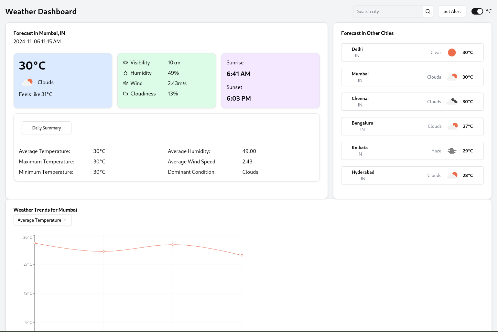

# Weather Monitoring System

> Zeotap | software Engineer Intern | Assignment | Application 2

## Overview

This Weather Monitoring System is a full-stack application that fetches real-time weather data for multiple cities, calculates daily summaries, and provides alerting capabilities based on user-defined thresholds.

## Features

- Real-time weather data fetching for multiple cities
- Daily weather summaries including average, maximum, and minimum temperatures
- User-configurable weather alerts
- RESTful API for weather data and alerts
- Frontend dashboard for data visualization

## Tech Stack

- Backend: Node.js with Express.js
- Frontend: React.js
- Database: MongoDB

## Prerequisites

Before you begin, ensure you have met the following requirements:

- Node.js (v14 or later)
- npm (v6 or later)
- MongoDB (v4 or later)
- An OpenWeatherMap API key

## Installation

1. Clone the repository:
```
git clone [https://github.com/your-username/weather-monitoring-system.git](https://github.com/your-username/weather-monitoring-system.git)
cd weather-monitoring-system
```

2. Install backend dependencies:
```
npm install
```

3. Install frontend dependencies:
```
cd ./frontend
npm install
```

4. Create a `.env` file in the `project` directory with the following content:
```
MONGODB_URI=your_mongodb_connection_string
OPENWEATHERMAP_API_KEY=your_openweathermap_api_key
PORT=5000
MAIL_ID=your_email_id
APP_PASS=your_email_app_password
```
5. Create another `.env` file in `./frontend` directory with content:
```
VITE_API_BASE_URL= your_backend_url (http://localhost:5000)
```

## Running the Application

1. Start the backend server:
```
npm start
```

2. In a new terminal, start the frontend development server:
```
cd frontend
npm start
```

3. Open your browser and navigate to `http://localhost:3000` to view the application.


## API Endpoints

- GET `/api/weather/:city` - Get current weather for a city
- GET `/api/summary/:city` - Get daily summary for a city
- GET `/api/summaries/:city` - Get all summaries for a city
- POST `/api/setAlert` - Set a new weather alert

## Design Choices

1. **Microservice Architecture**: The application is divided into backend and frontend services, allowing for independent scaling and maintenance.

2. **RESTful API**: The backend exposes a RESTful API, making it easy to integrate with various frontend frameworks or mobile applications in the future.

3. **Cron Jobs**: We use node-cron to schedule periodic weather data fetching, ensuring our database is always up-to-date without overwhelming the OpenWeatherMap API.

4. **MongoDB**: Chosen for its flexibility with document-based storage, which is ideal for storing varying weather data structures.

5. **React Hooks**: The frontend extensively uses React Hooks for state management and side effects, promoting cleaner and more maintainable code.

6. **Error Handling**: Comprehensive error handling is implemented both in the backend and frontend to provide informative feedback to users.

7. **Email Notifications**: Nodemailer is used to send email alerts when user-defined weather thresholds are breached.

## UI


## Dependencies

### Backend Dependencies

- express: Web application framework
- mongoose: MongoDB object modeling tool
- node-cron: Task scheduler in Node.js
- axios: Promise based HTTP client
- nodemailer: Send emails from Node.js
- dotenv: Loads environment variables from .env file
- cors: Enable CORS with various options

### Frontend Dependencies

- react: JavaScript library for building user interfaces
- react-dom: React package for working with the DOM
- axios: Promise based HTTP client
- chart.js: JavaScript charting library
- react-chartjs-2: React wrapper for Chart.js
